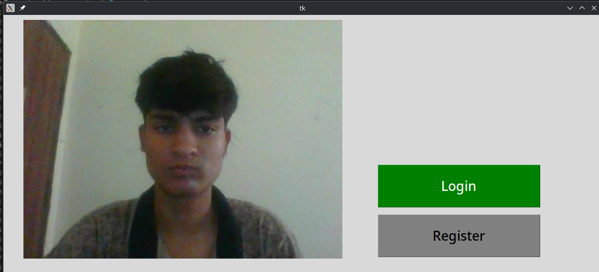
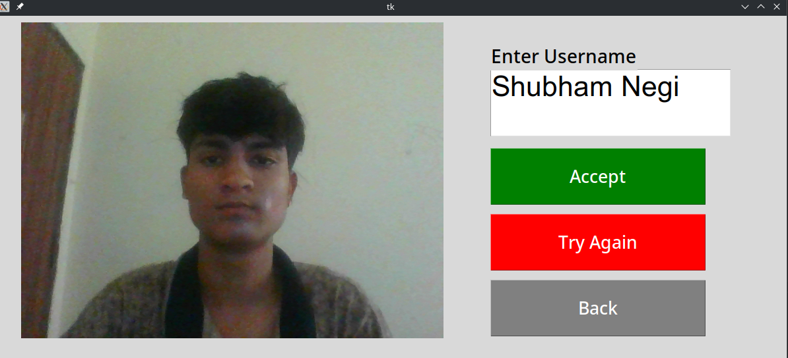
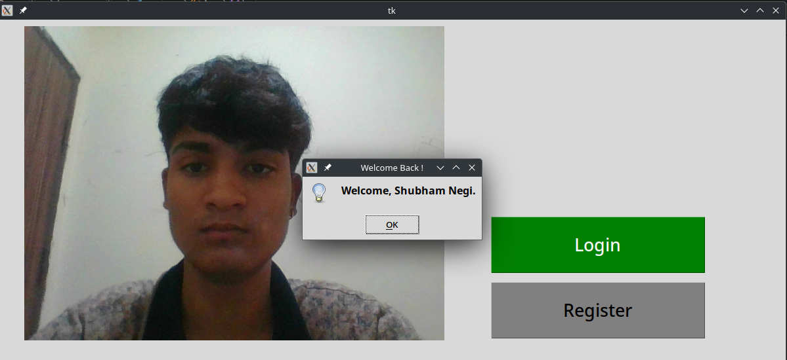

# Face-Recognition for Database Login/Attendance Automation

## Description
This project is a face recognition application with an additional feature to detect spoofing attempts. 
The application uses a webcam to capture images, allowing users to log in or register new accounts through facial recognition. The key features include:

### Face Recognition

The application identifies registered users by comparing live webcam images with stored face embeddings. If a match is found, the user is successfully logged in.

### User Registration

New users can register by capturing a face image, which is then processed to extract facial features and store them securely for future recognition.

### Logging

The application keeps a log of successful logins, recording the user's name and the time of access.

### Anti-Spoofing

The application incorporates an anti-spoofing script that analyzes the captured image to determine if it’s a real face or a spoof (e.g., a photo or video of a face). This adds an extra layer of security by preventing unauthorized access using fake images.

This project demonstrates a practical implementation of face recognition and anti-spoofing technologies, providing a secure and user-friendly way to manage access through biometric authentication.

## Installation
1. Clone the repository: [https://github.com/ShubhamNegi4/Face-Recognition.git](https://github.com/ShubhamNegi4/Face-Recognition.git)
2. Install dependencies from `requirements_windows.txt`.
3. Run the project.
